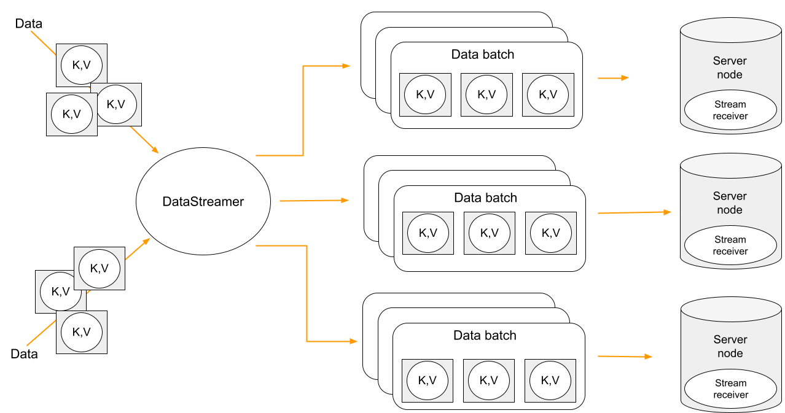

// Licensed to the Apache Software Foundation (ASF) under one or more
// contributor license agreements.  See the NOTICE file distributed with
// this work for additional information regarding copyright ownership.
// The ASF licenses this file to You under the Apache License, Version 2.0
// (the "License"); you may not use this file except in compliance with
// the License.  You may obtain a copy of the License at
//
// http://www.apache.org/licenses/LICENSE-2.0
//
// Unless required by applicable law or agreed to in writing, software
// distributed under the License is distributed on an "AS IS" BASIS,
// WITHOUT WARRANTIES OR CONDITIONS OF ANY KIND, either express or implied.
// See the License for the specific language governing permissions and
// limitations under the License.
= Data Streaming

:javaFile: {javaCodeDir}/DataStreaming.java

== Overview

Ignite provides a Data Streaming API that can be used to inject large amounts of data into an Ignite cluster.
The main goal of streaming is efficient, quick data loading. The data that is added to the streamer is
automatically organized and distributed between the nodes in partition-aware and parallel manner.

The Data Streaming API is designed to be scalable and provides _at-least-once_ delivery semantics
for the data streamed into Ignite, meaning each entry is processed at least once.

== Usage
A data streamer is associated with a specific cache and provides an interface for streaming data into the cache.

In a typical scenario, you obtain a data streamer and use one of its methods to stream data into the cache, and Ignite takes care of the rest.

You can obtain the data streamer for a specific cache as follows:
[tabs]
--
tab:Java[]
[source, java]
----
include::{javaFile}[tag=dataStreamer1,indent=0]
----

In the Java version of Ignite, a data streamer is an implementation of the `IgniteDataStreamer` interface. `IgniteDataStreamer` provides a number of `addData(...)` methods for adding key-value pairs to caches. Refer to the link:{javadoc_base_url}/org/apache/ignite/IgniteDataStreamer.html[IgniteDataStreamer] javadoc for the complete list of methods.

tab:C#/.NET[]
[source,csharp]
----
include::code-snippets/dotnet/DataStreaming.cs[tag=dataStreamer1,indent=0]
----

tab:C++[unsupported]
--

The streamer can accept data to load by multiple threads.

A good use of streaming is data preloading.

== Limitations
DataStreamer doesn't guarantee:
[]
- By default, data consistency until successfully finished;
- Immediate data loading. Data can be kept for a while before loading;
- Data order. Data records may be loaded into a cache in a different order compared to load into the streamer;
- By default, working with external storages.

If <<overwritting, 'allowOverwrite'>> property is 'false' (default), consider:
[]
- You should not have the same keys repeating in the data being streamed;
- Streamer cancelation or streamer node failure can cause data inconsistency;
- If loading into a persistent cache, concurrently created snapshot may contain inconsistent data and might not be restored entirely.

Most important behavior of Ignite Data Streamer is defined by <<receivers, stream receiver>> and
<<overwritting, 'allowOverwite' setting.>>

== Streamer receivers. [[receivers]]

Ignite DataStreamer is an orchestrator and doesn't write data itself. link:{javadoc_base_url}/org/apache/ignite/stream/StreameReceiver.html[StreamerReceiver] does. The default receiver is designed for fastest load and fewer network requests. With this receiver, streamer focuses on parallel transfer of backup and primary records.

You can set your own receiver. See <<transfomer>> and <<visitor>>. The logic implemented in a stream receiver is executed on the node where data is to be stored.

[tabs]
--
tab:Java[]
[source,java]
----
include::{javaFile}[tag=streamReceiver,indent=0]
----

tab:C#/.NET[]
[source,csharp]
----
include::code-snippets/dotnet/DataStreaming.cs[tag=streamReceiver,indent=0]
----

tab:C++[unsupported]
--

[IMPORTANT]
====
The class definitions of the stream receivers to be executed on remote nodes must be available on the nodes. This can be achieved in two ways:

* Add the classes to the classpath of the nodes;
* Enable link:code-deployment/peer-class-loading[peer class loading].
====

Changing receiver to non-default changes data distribution algorithm. With non-default receiver streamer sends data batches only to primary node receiver. And primary node needs another requests to send backup writes.

NOTE: A stream receiver does not put data into cache automatically. You need to call one of the `put` methods explicitly.

== Overwritting data. [[overwritting]]

By default, existing keys aren't overwritten. You can change that behavior by setting the `allowOverwrite` property of the data streamer to `true`. Since the default receiver does not overwrite data, other provided one is automatically chosen. Any non-default receiver is considered as not-overwriting. And `allowOverwrite` property says `true`. However, your own receiver may use `putIfAbsent` for instance.

NOTE: When `allowOverwrite` is set to `false` (default), the updates are not propagated to the link:persistence/external-storage[external storage] (if it is used).

[tabs]
--
tab:Java[]
[source,java]
----
include::{javaFile}[tag=dataStreamer2,indent=0]
----

tab:C#/.NET[]
[source,csharp]
----
include::code-snippets/dotnet/DataStreaming.cs[tag=dataStreamer2,indent=0]
----

tab:C++[unsupported]
--

=== Stream Transformer [[transfomer]]
A stream transformer is a convenient implementation of a stream receiver, that updates the data in the stream.
Stream transformers take advantage of the colocation feature and update the data on the node where it is going to be stored.

In the example below, we use a stream transformer to increment a counter for each distinct word found in the text stream.

[tabs]
--
tab:Java[]
[source,java]
----
include::{javaFile}[tag=streamTransformer,indent=0]
----

tab:C#/.NET[]
[source,csharp]
----
include::code-snippets/dotnet/DataStreaming.cs[tag=streamTransformer,indent=0]
----

tab:C++[unsupported]
--

=== Stream Visitor [[visitor]]

A stream visitor is another implementation of a stream receiver, which visits every key-value pair in the stream.

In the example below, we have 2 caches: "marketData", and "instruments". We receive market data ticks and put them into the streamer for the "marketData" cache. The stream visitor for the "marketData" streamer is invoked on the cluster member mapped to the particular market symbol. Upon receiving individual market ticks it updates the "instrument" cache with the latest market price.

Note, that we do not update the "marketData" cache at all, leaving it empty. We simply use it for colocated processing of the market data within the cluster directly on the node where the data is stored.
[tabs]
--
tab:Java[]
[source,java]
----
include::{javaFile}[tag=stream-visitor,indent=0]
----

tab:C#/.NET[]
[source,csharp]
----
include::code-snippets/dotnet/DataStreaming.cs[tag=streamVisitor,indent=0]
----

tab:C++[unsupported]
--

== Configuring Data Streamer Thread Pool Size
The data streamer thread pool is dedicated to process batches coming from the data streamers.

The default pool size is `max(8, total number of cores)`.
Use `IgniteConfiguration.setDataStreamerThreadPoolSize(...)` to change the pool size.

[tabs]
--
tab:XML[]
[source,xml]
----
<bean class="org.apache.ignite.configuration.IgniteConfiguration">
    <property name="dataStreamerThreadPoolSize" value="10"/>

    <!-- other properties -->

</bean>
----

tab:Java[]
[source,java]
----
include::{javaFile}[tag=pool-size,indent=0]
----

tab:C#/.NET[unsupported]

tab:C++[unsupported]
--
