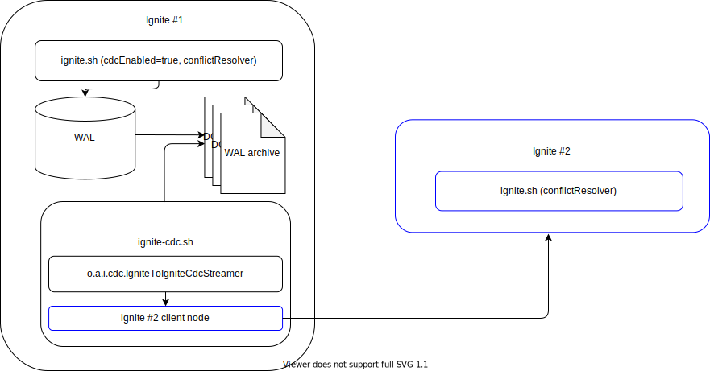
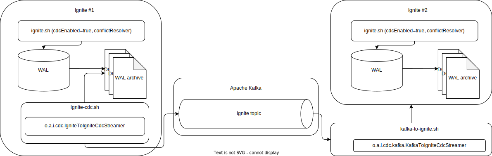

// Licensed to the Apache Software Foundation (ASF) under one or more
// contributor license agreements.  See the NOTICE file distributed with
// this work for additional information regarding copyright ownership.
// The ASF licenses this file to You under the Apache License, Version 2.0
// (the "License"); you may not use this file except in compliance with
// the License.  You may obtain a copy of the License at
//
// http://www.apache.org/licenses/LICENSE-2.0
//
// Unless required by applicable law or agreed to in writing, software
// distributed under the License is distributed on an "AS IS" BASIS,
// WITHOUT WARRANTIES OR CONDITIONS OF ANY KIND, either express or implied.
// See the License for the specific language governing permissions and
// limitations under the License.
= Change Data Capture Extension

WARNING: CDC is an experimental feature. API or design architecture might be changed.

== Overview
link:https://github.com/apache/ignite-extensions/tree/master/modules/cdc-ext[Change Data Capture Extension] module provides two ways to set up cross cluster replication based on CDC.

. link:https://github.com/apache/ignite-extensions/blob/master/modules/cdc-ext/src/main/java/org/apache/ignite/cdc/thin/IgniteToIgniteClientCdcStreamer.java[Ignite2IgniteClientCdcStreamer] - streams changes to destination cluster using link:thin-clients/java-thin-client[Java Thin Client].
. link:https://github.com/apache/ignite-extensions/blob/master/modules/cdc-ext/src/main/java/org/apache/ignite/cdc/IgniteToIgniteCdcStreamer.java[Ignite2IgniteCdcStreamer] - streams changes to destination cluster using client node.
. link:https://github.com/apache/ignite-extensions/blob/master/modules/cdc-ext/src/main/java/org/apache/ignite/cdc/kafka/IgniteToKafkaCdcStreamer.java[Ignite2KafkaCdcStreamer] combined with link:https://github.com/apache/ignite-extensions/blob/master/modules/cdc-ext/src/main/java/org/apache/ignite/cdc/kafka/KafkaToIgniteCdcStreamer.java[KafkaToIgniteCdcStreamer] streams changes to destination cluster using link:https://kafka.apache.org[Apache Kafka] as a transport.

NOTE: For each cache replicated between clusters link:https://github.com/apache/ignite/blob/master/modules/core/src/main/java/org/apache/ignite/internal/processors/cache/version/CacheVersionConflictResolver.java[CacheVersionConflictResolver] should be defined.

NOTE: All implementations of CDC replication support replication of link:https://ignite.apache.org/releases/latest/javadoc/org/apache/ignite/binary/BinaryType.html[BinaryTypes] and link:https://ignite.apache.org/releases/latest/javadoc/org/apache/ignite/cdc/TypeMapping.html[TypeMappings]

== Ignite to Java Thin Client CDC streamer
This streamer starts link:thin-clients/java-thin-client[Java Thin Client] which connects to destination cluster.
After connection is established, all changes captured by CDC will be replicated to destination cluster.

NOTE: Instances of `ignite-cdc.sh` with configured streamer should be started on each server node of source cluster to capture all changes.


=== Configuration

[cols="20%,45%,35%",opts="header"]
|===
|Name |Description | Default value
| `caches` | Set of cache names to replicate. | null
| `destinationClientConfiguration` | Client configuration of thin client that will connect to destination cluster to replicate changes. | null
| `onlyPrimary` | Flag to handle changes only on primary node. | `false`
| `maxBatchSize` | Maximum number of events to be sent to destination cluster in a single batch. | 1024
|===

=== Metrics

|===
|Name |Description
| `EventsCount` | Count of messages applied to destination cluster.
| `LastEventTime` | Timestamp of last applied event.
| `TypesCount` | Count of received binary types events.
| `MappingsCount` | Count of received mappings events.
|===

== Ignite to Ignite CDC streamer
This streamer starts client node which connects to destination cluster.
After connection is established, all changes captured by CDC will be replicated to destination cluster.

NOTE: Instances of `ignite-cdc.sh` with configured streamer should be started on each server node of source cluster to capture all changes.



=== Configuration

[cols="20%,45%,35%",opts="header"]
|===
|Name |Description | Default value
| `caches` | Set of cache names to replicate. | null
| `destinationIgniteConfiguration` | Ignite configuration of client nodes that will connect to destination cluster to replicate changes. | null
| `onlyPrimary` | Flag to handle changes only on primary node. | `false`
| `maxBatchSize` | Maximum number of events to be sent to destination cluster in a single batch. | 1024
|===

=== Metrics

|===
|Name |Description
| `EventsCount` | Count of messages applied to destination cluster.
| `LastEventTime` | Timestamp of last applied event.
| `TypesCount` | Count of received binary types events.
| `MappingsCount` | Count of received mappings events.
|===

== CDC replication using Kafka

This way to replicate changes between clusters requires setting up two applications:

. `ignite-cdc.sh` with `org.apache.ignite.cdc.kafka.IgniteToKafkaCdcStreamer` that will capture changes from source cluster and write it to Kafka topic.
. `kafka-to-ignite.sh` that will read changes from Kafka topic and then write them to destination cluster.

NOTE: Instances of `ignite-cdc.sh` with configured streamer should be started on each server node of source cluster to capture all changes.

IMPORTANT: CDC trough Kafka requires _metadata topic with the only one partition_ for sequential ordering guarantees.



=== IgniteToKafkaCdcStreamer Configuration

[cols="20%,45%,35%",opts="header"]
|===
|Name |Description | Default value
| `caches` | Set of cache names to replicate. | null
| `kafkaProperties` | Kafka producer properties. | null
| `topic` | Name of the Kafka topic for CDC events. | null
| `kafkaParts` | Number of Kafka partitions in CDC events topic. | null
| `metadataTopic` | Name of topic for replication of BinaryTypes and TypeMappings. | null
| `onlyPrimary` | Flag to handle changes only on primary node. | `false`
| `maxBatchSize` | Maximum size of concurrently produced Kafka records. When streamer reaches this number, it waits for Kafka acknowledgements, and then commits CDC offset. | `1024`
| `kafkaRequestTimeout` | Kafka request timeout in milliseconds.  | `3000`
|===

`kafkaRequestTimeout` property sets how much `IgniteToKafkaCdcStreamer` will wait for `KafkaProducer` to finish request. Also, proper `KafkaProducer` configuration should be provided, including link:https://kafka.apache.org/documentation/#producerconfigs_request.timeout.ms[request.timeout.ms]. For more details you should refer to a link:https://kafka.apache.org/documentation/#configuration[configuration]
section of the official Kafka documentation.

NOTE: `kafkaRequestTimeout` should not be too low, because `IgniteToKafkaCdcStreamer` will wait for `KafkaProducer` to send messages to a broker, and if wait time exceeds `kafkaRequestTimeout`, then `IgniteToKafkaCdcStreamer` will fail with a timeout error.

=== IgniteToKafkaCdcStreamer Metrics

|===
|Name |Description
| `EventsCount` | Count of messages applied to destination cluster.
| `LastEventTime` | Timestamp of last applied event.
| `BytesSent` | Number of bytes send to Kafka.
|===

=== `kafka-to-ignite.sh` application

This application should be started near the destination cluster.
`kafka-to-ignite.sh` will read CDC events from Kafka topic and then apply them to destination cluster.

IMPORTANT: `kafka-to-ignite.sh` implements the fail-fast approach. It just fails in case of any error. The restart procedure should be configured with the OS tools.

Count of instances of the application does not corellate to the count of destination server nodes.
It should be just enough to process source cluster load.
Each instance of application will process configured subset of topic partitions to spread the load.
`KafkaConsumer` for each partition will be created to ensure fair reads.

==== Installation

. Build `cdc-ext` module with maven:
+
```console
  $~/src/ignite-extensions/> mvn clean package -DskipTests
  $~/src/ignite-extensions/> ls modules/cdc-ext/target | grep zip
ignite-cdc-ext.zip
```

. Unpack `ignite-cdc-ext.zip` archive to `$IGNITE_HOME` folder.

Now, you have additional binary `$IGNITE_HOME/bin/kafka-to-ignite.sh` and `$IGNITE_HOME/libs/optional/ignite-cdc-ext` module.

NOTE: Please, enable `ignite-cdc-ext` to be able to run `kafka-to-ignite.sh`.

==== Configuration

Application configuration should be done using POJO classes or Spring xml file like regular Ignite node configuration.
Kafka to Ignite configuration file should contain the following beans that will be loaded during startup:

. One of the configuration beans to define a client type that will connect to the destination cluster:
- `IgniteConfiguration` bean: Configuration of a client node.
- `ClientConfiguration` bean: Configuration of a link:thin-clients/java-thin-client[Java Thin Client].
. `java.util.Properties` bean with the name `kafkaProperties`: Single Kafka consumer configuration.
. `org.apache.ignite.cdc.kafka.KafkaToIgniteCdcStreamerConfiguration` bean: Options specific to `kafka-to-ignite.sh` application.

[cols="20%,45%,35%",opts="header"]
|===
|Name |Description | Default value
| `caches` | Set of cache names to replicate. | null
| `topic` | Name of the Kafka topic for CDC events. | null
| `kafkaPartsFrom` | Lower Kafka partitions number (inclusive) for CDC events topic. | -1
| `kafkaPartsTo` | Lower Kafka partitions number (exclusive) for CDC events topic. | -1
| `metadataTopic` | Name of topic for replication of BinaryTypes and TypeMappings. | null
| `metadataConsumerGroup` | Group for `KafkaConsumer`, which polls from metadata topic | ignite-metadata-update-<kafkaPartsFrom>-<kafkaPartsTo>
| `kafkaRequestTimeout` | Kafka request timeout in milliseconds.  | `3000`
| `maxBatchSize` | Maximum number of events to be sent to destination cluster in a single batch. | 1024
| `threadCount` | Count of threads to proceed consumers. Each thread poll records from dedicated partitions in round-robin manner. | 16
|===

`kafkaRequestTimeout` property is used as timeout for `KafkaConsumer` methods. Also, proper `KafkaConsumer` configuration should be provided, including link:https://kafka.apache.org/documentation/#consumerconfigs_request.timeout.ms[request.timeout.ms]. For more details you should refer to a link:https://kafka.apache.org/documentation/#configuration[configuration] section of the official Kafka documentation.

NOTE: `kafkaRequestTimeout` should not be too low, because `kafka-to-ignite.sh` will fail with a timeout error, if `KafkaConsumer` method execution time exceeds `kafkaRequestTimeout` (except for `KafkaConsumer#poll`). `kafkaRequestTimeout` should not be very high too, because poll can wait up to this timeout, which prevents further partitions to be processed.

==== Logging

`kafka-to-ignite.sh` uses the same logging configuration as the Ignite node does. The only difference is that the log is written in the "kafka-ignite-streamer.log" file.

== CacheVersionConflictResolver implementation

It expected that CDC streamers will be configured with the `onlyPrimary=false` in most real-world deployments to ensure fault-tolerance.
That means streamer will send the same change several times equal to `CacheConfiguration#backups` + 1.
At the same time concurrent updates of the same key can be done in replicated clusters.
`CacheVersionConflictResolver` used by Ignite node to selects or merge new (from update request) and existing (stored in the cluster) entry versions.
Selected entry version will be actually stored in the cluster.

NOTE: Default implementation only select correct entry and never merge.

link:https://github.com/apache/ignite/blob/master/modules/core/src/main/java/org/apache/ignite/internal/processors/cache/version/CacheVersionConflictResolver.java[CacheVersionConflictResolver] should be defined for each cache replicated between clusters.

Default link:https://github.com/apache/ignite-extensions/blob/master/modules/cdc-ext/src/main/java/org/apache/ignite/cdc/conflictresolve/CacheVersionConflictResolverImpl.java[implementation] is available in cdc-ext.

=== Configuration

[cols="20%,45%,35%",opts="header"]
|===
|Name |Description | Default value
| `clusterId` | Local cluster id. Can be any value from 1 to 31. | null
| `caches` | Set of cache names to handle with this plugin instance. | null
| `conflictResolveField` | Value field to resolve conflict with. Optional. Field values must implement `java.lang.Comparable`. | null
|===

=== Conflict resolve algorithm

Replicated changes contain some additional data. Specifically, entry version from source cluster supplied with the changed data.
Default conflict resolve algorithm based on entry version and `conflictResolveField`.
Conflict resolution field should contain user provided monotonically increasing value such as query id or timestamp.

. Changes from the "local" cluster always win.
. If both old and new entry from the same cluster version comparison used to determine order.
. If `conflictResolveField` if provided then field values comparison used to determine order.
. Conflict resolution failed. Update will be ignored.

=== Configuration example
Configuration is done via Ignite node plugin:

```xml
<property name="pluginProviders">
    <bean class="org.apache.ignite.cdc.conflictresolve.CacheVersionConflictResolverPluginProvider">
        <property name="clusterId" value="1" />
        <property name="caches">
            <util:list>
                <bean class="java.lang.String">
                    <constructor-arg type="String" value="queryId" />
                </bean>
            </util:list>
        </property>
    </bean>
</property>
```
