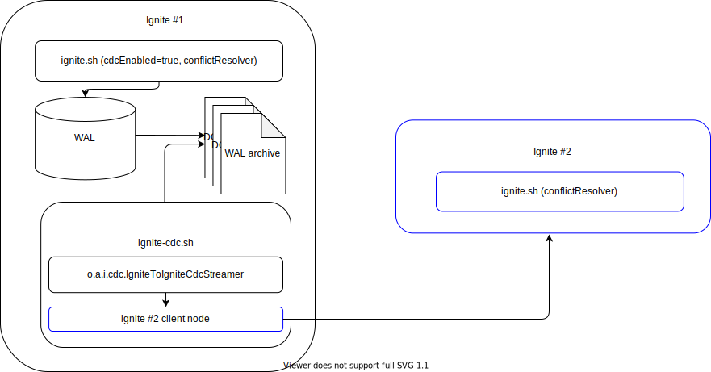

// Licensed to the Apache Software Foundation (ASF) under one or more
// contributor license agreements.  See the NOTICE file distributed with
// this work for additional information regarding copyright ownership.
// The ASF licenses this file to You under the Apache License, Version 2.0
// (the "License"); you may not use this file except in compliance with
// the License.  You may obtain a copy of the License at
//
// http://www.apache.org/licenses/LICENSE-2.0
//
// Unless required by applicable law or agreed to in writing, software
// distributed under the License is distributed on an "AS IS" BASIS,
// WITHOUT WARRANTIES OR CONDITIONS OF ANY KIND, either express or implied.
// See the License for the specific language governing permissions and
// limitations under the License.
= Change Data Capture Extension

WARNING: CDC is an experimental feature whose API or design architecture might be changed.

== Overview
link:https://github.com/apache/ignite-extensions/tree/master/modules/cdc-ext[Change Data Capture Extension] module provides two way to setup cross cluster replication based on CDC.

. link:https://github.com/apache/ignite-extensions/blob/master/modules/cdc-ext/src/main/java/org/apache/ignite/cdc/IgniteToIgniteCdcStreamer.java[Ignite2IgniteCdcStreamer] - stream changes to destination cluster using client node.
. link:https://github.com/apache/ignite-extensions/blob/master/modules/cdc-ext/src/main/java/org/apache/ignite/cdc/kafka/IgniteToKafkaCdcStreamer.java[Ignite2KafkaCdcStreamer] combined with link:https://github.com/apache/ignite-extensions/blob/master/modules/cdc-ext/src/main/java/org/apache/ignite/cdc/kafka/KafkaToIgniteCdcStreamer.java[KafkaToIgniteCdcStreamer] streams changes to destination cluster using link:https://kafka.apache.org[Apache Kafka] as a transport.

NOTE: For each cache which replicated between clusters link:https://github.com/apache/ignite/blob/master/modules/core/src/main/java/org/apache/ignite/internal/processors/cache/version/CacheVersionConflictResolver.java[CacheVersionConflictResolver] should be defined.
Default link:https://github.com/apache/ignite-extensions/blob/master/modules/cdc-ext/src/main/java/org/apache/ignite/cdc/conflictresolve/CacheVersionConflictResolverImpl.java[implementation] available in cdc-ext.

== Ignite to Ignite CDC streamer

This streamer on starts client node which connects to destination cluster.
Then all changes captured by CDC replicated to destination cluster.

NOTE: Instances of `ignite-cdc.sh` with configured streamer should be started on each server node of source cluster to capture all changes.

== Configuration

