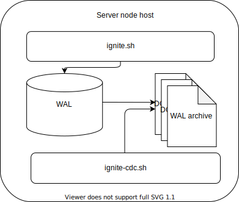

// Licensed to the Apache Software Foundation (ASF) under one or more
// contributor license agreements.  See the NOTICE file distributed with
// this work for additional information regarding copyright ownership.
// The ASF licenses this file to You under the Apache License, Version 2.0
// (the "License"); you may not use this file except in compliance with
// the License.  You may obtain a copy of the License at
//
// http://www.apache.org/licenses/LICENSE-2.0
//
// Unless required by applicable law or agreed to in writing, software
// distributed under the License is distributed on an "AS IS" BASIS,
// WITHOUT WARRANTIES OR CONDITIONS OF ANY KIND, either express or implied.
// See the License for the specific language governing permissions and
// limitations under the License.
= Change Data Capture

== Overview
Change Data Capture (link:https://en.wikipedia.org/wiki/Change_data_capture[CDC]) is a data processing pattern used to asynchronously receive entries that have been changed on the local node so that action can be taken using the changed entry.

WARNING: CDC is an experimental feature. API or design architecture might be changed.

Below are some CDC use cases:

 * Streaming changes in Warehouse;
 * Updating search index;
 * Calculating statistics (streaming queries);
 * Auditing logs;
 * Async interaction with extenal system: Moderation, business process invocation, etc.

Ignite implements CDC with the `ignite-cdc.sh` application and link:https://github.com/apache/ignite/blob/master/modules/core/src/main/java/org/apache/ignite/cdc/CdcConsumer.java#L56[Java API].

Below are the CDC application and the Ignite node integrated via WAL archive segments:

When CDC is enabled, the Ignite server node creates a hard link to each WAL archive segment in the special `db/cdc/\{consistency_id\}` directory.
The `ignite-cdc.sh` application runs on a different JVM and processes newly archived link:persistence/native-persistence#_write-ahead_log[WAL segments].
When the segment is fully processed by `ignite-cdc.sh`, it is removed. The actual disk space is free when both links (archive and CDC) are removed.

State of consumption is a pointer to the last processed event.
Consumer can tell to `ignite-cdc.sh` to save the consumption state.
On startup event processing will be continued from the last saved state.

== Configuration

=== Ignite Node

[cols="20%,45%,35%",opts="header"]
|===
|Name |Description | Default value
| `DataRegionConfiguration#cdcEnabled` | Flag to enable CDC on the server node. | `false`
| `DataStorageConfiguration#cdcWalPath` | Path to the CDC directory | `"db/wal/cdc"`
| `DataStorageConfiguration#walForceArchiveTimeout` | Timeout to forcefully archive the WAL segment even it is not complete. | `-1` (disabled)
|===

=== CDC Application

CDC is configured in the same way as the Ignite node - via the spring XML file:

* `ignite-cdc.sh` requires both Ignite and CDC configurations to start;
* `IgniteConfiguration` is used to determine common options like a path to the CDC directory, node consistent id, and other parameters;
* `CdcConfiguration` contains `ignite-cdc.sh`-specific options.

[cols="20%,45%,35%",opts="header"]
|===
|Name |Description | Default value
| `lockTimeout` | Timeout to wait for lock acquiring. CDC locks directory on a startup to ensure there is no concurrent `ignite-cdc.sh` processing the same directory.
| 1000 milliseconds.
| `checkFrequency` | Amount of time application sleeps between subsequent checks when no new files available. | 1000 milliseconds.
| `keepBinary` | Flag to specify if key and value of changed entries should be provided in link:key-value-api/binary-objects[binary format]. | `true`
| `consumer` | Implementation of `org.apache.ignite.cdc.CdcConsumer` that consumes entries changes. | null
| `metricExporterSpi` | Array of SPI's to export CDC metrics. See link:monitoring-metrics/new-metrics-system#_metric_exporters[metrics] documentation, also. | null
|===

=== Distributed properties

The distributed properties listed in the table below allow you to configure CDC at runtime:

[cols="1,3,1",opts="header"]
|===
|Property | Description | Default Value
|`cdc.disabled`| Disables CDC in the cluster to avoid disk overflow. Note that cache changes will be lost when CDC
is disabled. Useful if the CDC application is down for a long time. | false
|===

== API

=== `org.apache.ignite.cdc.CdcEvent`

Below is a single change of the data reflected by `CdcEvent`. 

[cols="20%,80%",opts="header"]
|===
|Name |Description
| `key()` | Key for the changed entry.
| `value()` | Value for the changed entry. This method will return `null` if the event reflects removal.
| `cacheId()` | ID of the cache where the change happens. The value is equal to the `CACHE_ID` from link:monitoring-metrics/system-views#_CACHES[`SYS.CACHES`].
| `partition()` | Partition of the changed entry.
| `primary()` | Flag to distinguish if operation happens on the primary or a backup node.
| `version()` | `Comparable` version of the changed entry. Internally, Ignite maintains ordered versions of each entry so any changes of the same entry can be sorted.
|===

=== `org.apache.ignite.cdc.CdcConsumer`

The consumer of change events.  It should be implemented by the user.
[cols="20%,80%",opts="header"]
|===
|Name |Description
| `void start(MetricRegistry)` | Invoked one-time at the start of the CDC application. `MetricRegistry` should be used to export the consumer-specific metrics.
| `boolean onEvents(Iterator<CdcEvent> events)` | The main method that processes changes. When this method returns `true`, the state is saved on the disk. State points to the event next to the last read event. In case of any failure, consumption will continue from the last saved state.
| `void stop()` | Invokes one-time at the stop of the CDC application.
|===

== Metrics

`ignite-cdc.sh` uses the same SPI to export metrics as Ignite does.
The following metrics are provided by the application (additional metrics can be provided by the consumer):
|===
|Name |Description
| CurrentSegmentIndex | Index of the currently processing WAL segment.
| CommittedSegmentIndex | Index of the WAL segment that contains the last committed state.
| CommittedSegmentOffset | Committed offset in bytes inside the WAL segment.
| LastSegmentConsumptionTime | Timestamp (in milliseconds) indicating the last segment processing start.
| BinaryMetaDir | Binary meta-directory the application reads data from.
| MarshallerDir | Marshaller directory the application reads data from.
| CdcDir | The CDC directory the application reads data from.
|===

== Logging

`ignite-cdc.sh` uses the same logging configuration as the Ignite node does. The only difference is that the log is written in the"ignite-cdc.log" file.

== Lifecycle

IMPORTANT: `ignite-cdc.sh` implements the fail-fast approach. It just fails in case of any error. The restart procedure should be configured with the OS tools.

 1. Find the required shared directories. Take the values from the provided `IgniteConfiguration`.
 2. Lock the CDC directory.
 3. Load the saved state.
 4. Start the consumer.
 5. Infinitely wait for the newly available segment and process it.
 6. Stop the consumer in case of a failure or a received stop signal.

== Handling skipped segments

The CDC can be disabled manually or by configured directory maximum size. In this case a hard link creation will be skipped.

WARNING: All changes in skipped segments will be lost!

So when enabled there will be gap between segments: `0000000000000002.wal`, `0000000000000010.wal`, `0000000000000011.wal`, for example.
In this case `ignite-cdc.sh` will fail with the something like "Found missed segments. Some events are missed. Exiting! [lastSegment=2, nextSegment=10]".

NOTE: Make sure you need to sync data before restarting the CDC application. You can synchronize caches using
link:#forcefully-resend-all-cache-data-to-cdc[resend command], snapshot or other methods.

To fix this error you can run the following link:tools/control-script[Control Script] command:

[source,shell]
----
# Delete lost segment CDC links in the cluster.
control.sh|bat --cdc delete_lost_segment_links

# Delete lost segment CDC links on a node.
control.sh|bat --cdc delete_lost_segment_links --node-id node_id
----

The command will remove all segment links before the last gap.

For example, CDC was turned off several times: `000000000000002.wal`, `000000000000003.wal`, `000000000000008.wal`, `0000000000000010.wal`, `0000000000000011.wal`
Then, after the command is executed, the following segment links will be deleted: `000000000000002.wal`, `000000000000003.wal`, `000000000000008.wal`.
The application will start from the `0000000000000010.wal` segment after being enabled.

== Forcefully resend all cache data to CDC

When the CDC has been forcefully disabled for a while, cache changes will be skipped.
In this case it is necessary to resend data from existing caches.
For example, this is important if you need to ensure consistency of cache data before a replication restart.

NOTE: The command will be canceled if cluster was not rebalanced or topology changed (node left/joined, baseline changed).

To forcefully resend all cache data to CDC you can run the following link:tools/control-script[Control Script] command:

[source,shell]
----
# Forcefully resend all cache data to CDC. Iterates over caches and writes primary copies of data entries to the WAL to get captured by CDC:
control.sh|bat --cdc resend --caches cache1,...,cacheN
----

The command will iterate over caches and writes primary copies of data entries to the WAL to get captured by the CDC application.

NOTE: There are no guarantees of notifying the CDC consumer on concurrent cache updates: use the `CdcEvent#version` to resolve version.

== cdc-ext

Ignite extensions project has link:https://github.com/apache/ignite-extensions/tree/master/modules/cdc-ext[cdc-ext] module which provides two way to setup cross cluster replication based on CDC.
Detailed documentation can be found on link:extensions-and-integrations/change-data-capture-extensions[page].
