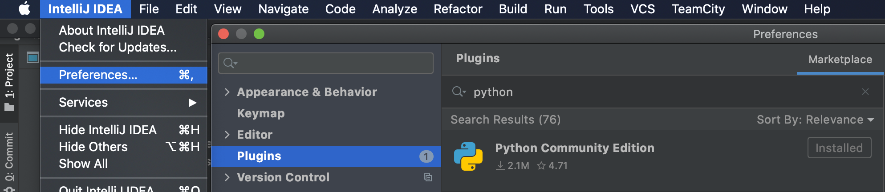
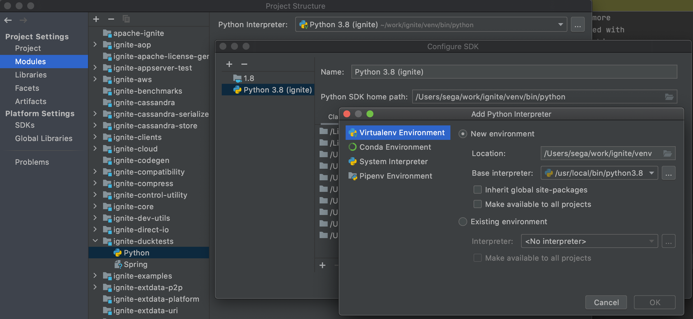

## Ignite-Ducktape setup the environment and running tests
Project ducktape https://github.com/confluentinc/ducktape

Branch apache-ignite https://github.com/apache/ignite/tree/ignite-ducktape

Development and tests are carried out in the module ignite-ducktests (modules/ducktests)

## The environment will require:
 - Java, recomended version 8 → https://openjdk.java.net/install 
 - IDE, for example IntelliJ IDEA enough version Community → https://www.jetbrains.com/idea/
 - Python, version not lower 3.6 →  https://www.python.org/downloads/
   - setup virtualenv, for example https://github.com/pyenv/pyenv can be install through `brew install pyenv`
 - Docker → https://www.docker.com/products/docker-desktop
   - in docker settings it is recommended to increase the allocated memory size to 8gb

## Setup IDE
 - Install Plugin Python for IDE:
  - IntelliJ Idea → Preferences → Plugins → Marketplaces → 'python' → Install

 - Configure in idea python to work
  - File → Project Structure → Modules → choose `ignite-ducktests` → `+` → Python → Virtualenv Environment → New environment
 

After that, you will see the name of your environment in the terminal and the python version will correspond to the selected

(**venv**) /Users/user/work/ignite$ python --version\
**Python 3.8.5**\
Pull up python dependencies: `pip install -r modules/ducktests/tests/docker/requirements.txt`\
Build project ignite: → `scripts/build.sh`

## Running tests
Recommended to use the script before running tests IGNITE/modules/ducktests/tests/docker/clean_up.sh
 - stops and removes all ducker-ignite containers

For run tests used `IGNITE/modules/ducktests/tests/docker/run_tests.sh`

The options are as follows:
-h|--help
    Display this help message.

-n|--num-nodes
    Specify how many nodes to start. Default number of nodes to start: 11.

-j|--max-parallel
    Specify max number of tests that can be run in parallel.

-p|--param
    Use specified param to inject in tests. Could be used multiple times.

    ./run_tests.sh --param version=2.8.1

-pj|--params-json
    Use specified json as parameters to inject in tests. Can be extended with -p|--param.

-g|--global
    Use specified global param to pass to test context. Could be used multiple times.

    List of supported global parameters:
    - project: is used to build path to Ignite binaries within container (/opt/PROJECT-VERSION)
    - ignite_client_config_path: abs path within container to Ignite client config template
    - ignite_server_config_path: abs path within container to Ignite server config template
    - jvm_opts: array of JVM options to use when Ignite node started
    - ignite_version: string representing ignite_versions to test against.

-gj|--global-json)
    Use specified json as globals to pass to test context. Can be extended with -g|--global

-t|--tc-paths
    Path to ducktests. Must be relative path to 'IGNITE/modules/ducktests/tests' directory
    
## Test results
Test results and logs are in {ignite-folder}/results

## Checks Python packages installed
Use util TOX → https://tox.readthedocs.io/en/latest/

Install util → `pip install tox`

Run the command to check: `cd IGNITE/modules/ducktests/tests; tox`

After executing the command, you will see:\
 `linter: commands succeeded congratulations :)`\
or\
 `ERROR:   linter: commands failed` with description.