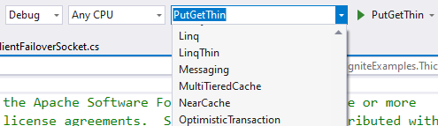
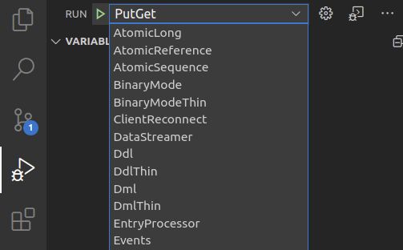
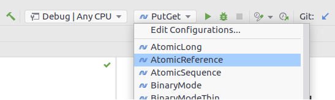
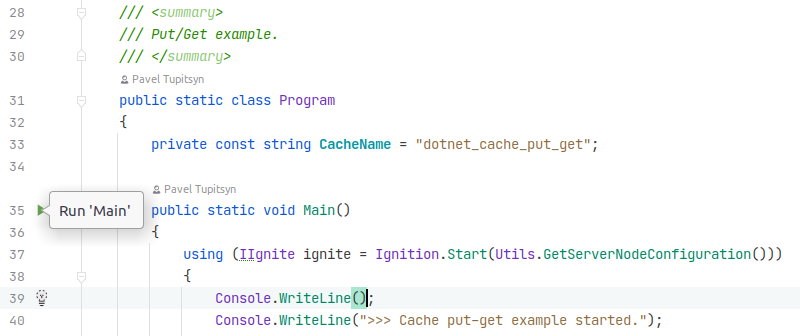

# Ignite.NET Examples

* Examples are grouped by Thick and Thin modes in corresponding folders.
* `Shared` project contains common code, such as configuration and model classes.
* `ServerNode` project is used to start Ignite server nodes.

# Requirements

* [.NET 6 SDK](https://dotnet.microsoft.com/download/dotnet-core)
* [JDK 8](https://www.oracle.com/java/technologies/javase/javase-jdk8-downloads.html) or [JDK 11](https://www.oracle.com/java/technologies/javase-jdk11-downloads.html)

Windows, Linux, and macOS are supported.

# Download Examples

* NuGet: 
  * `dotnet new --install Apache.Ignite.Examples`
  * `dotnet new ignite-examples`  
* Ignite website: https://ignite.apache.org/download.cgi
* git: `git clone https://github.com/apache/ignite --depth=1`, `cd ignite/modules/platforms/dotnet/examples`

# Run Examples

## Command Line

* Change to a specific example directory: `cd Thick/Cache/PutGet`
* `dotnet run`

Thin Client examples require one or mode Ignite server node, run this in a separate terminal window before starting the example:
* `cd ServerNode`
* `dotnet run`

## Visual Studio

* Open `Apache.Ignite.Examples.sln`
* Select an example on the Run toolbar and run

## VS Code

* Open current folder (from UI or with `code .` command)
* Open "Run" panel (`Ctrl+Shift+D` - default shortcut for `workbench.view.debug`)
* Select an example from the combobox on top and run

## Rider

* Open `Apache.Ignite.Examples.sln`
* Select an example on the Run toolbar and run

* Alternatively, open the example source code an run it using the sidebar icon

