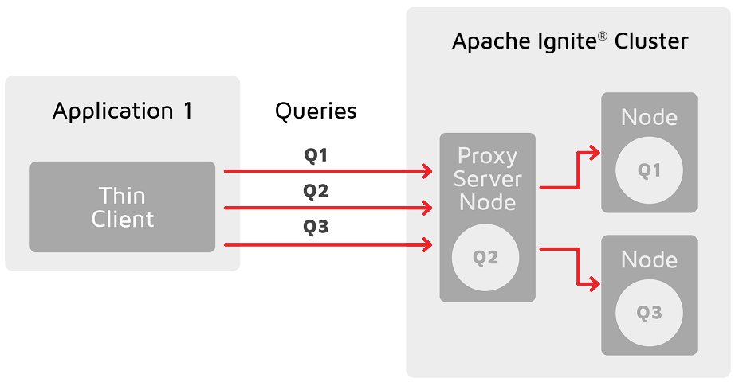
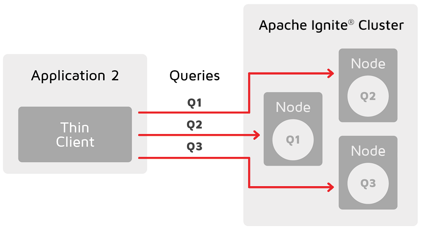

..  Licensed to the Apache Software Foundation (ASF) under one or more
    contributor license agreements.  See the NOTICE file distributed with
    this work for additional information regarding copyright ownership.
    The ASF licenses this file to You under the Apache License, Version 2.0
    (the "License"); you may not use this file except in compliance with
    the License.  You may obtain a copy of the License at

..      http://www.apache.org/licenses/LICENSE-2.0

..  Unless required by applicable law or agreed to in writing, software
    distributed under the License is distributed on an "AS IS" BASIS,
    WITHOUT WARRANTIES OR CONDITIONS OF ANY KIND, either express or implied.
    See the License for the specific language governing permissions and
    limitations under the License.

===================
Partition Awareness
===================

Partition awareness allows the thin client to send query requests directly to the node that owns the queried data.

Without partition awareness, an application that is connected to the cluster via a thin client executes all queries and operations via a single server node that acts as a proxy for the incoming requests. These operations are then re-routed to the node that stores the data that is being requested. This results in a bottleneck that could prevent the application from scaling linearly.

Notice how queries must pass through the proxy server node, where they are routed to the correct node.

With partition awareness in place, the thin client can directly route queries and operations to the primary nodes that own the data required for the queries. This eliminates the bottleneck, allowing the application to scale more easily.

Partition awareness can be enabled or disabled by setting `partition_aware` parameter in
:meth:`pyignite.client.Client.__init__` or :meth:`pyignite.aio_client.AioClient.__init__` to `True` (by default)
or `False`.

Also, it is recommended to pass list of address and port pairs of all server nodes
to :meth:`pyignite.client.Client.connect` or to :meth:`pyignite.aio_client.AioClient.connect`.

For example:

.. code-block:: python3

    from pyignite import Client

    client = Client(
        partition_awareness=True
    )
    nodes = [('10.128.0.1', 10800), ('10.128.0.2', 10800),...]
    with client.connect(nodes):
        ....

.. code-block:: python3

    from pyignite import AioClient

    client = AioClient(
        partition_awareness=True
    )
    nodes = [('10.128.0.1', 10800), ('10.128.0.2', 10800),...]
    async with client.connect(nodes):
        ....